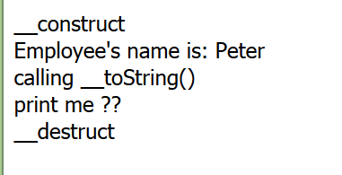
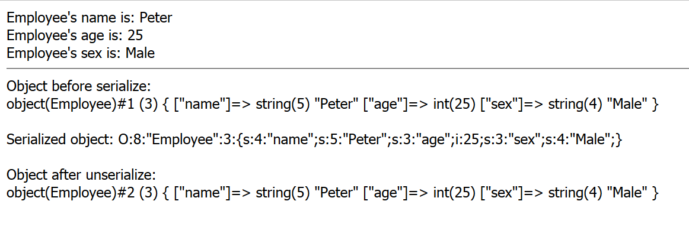
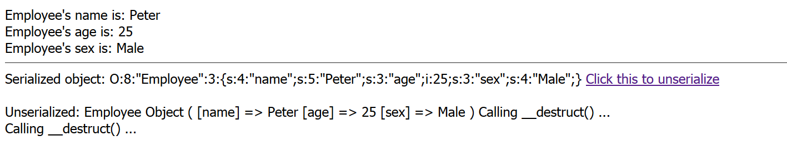
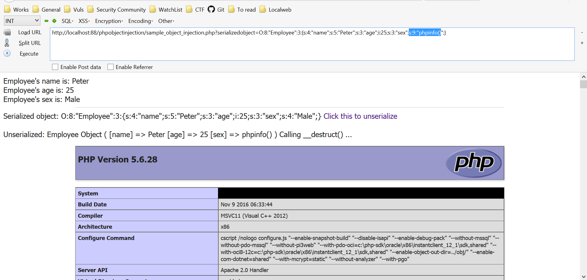

# __PHP Object Injection__
PHP has abilities called serializtion(serialize()) and unserializtion(unserialize()), since serializtion transform PHP objects into string and unserialization that decode string into PHP objects.

The vulnerability occurs when the application does not sanitize user-input before pass it to unserialize() PHP function. An attacker could craft serialized strings to a vulnerable unserialize() resulting in an arbitrary PHP object(s) injection into the application scope.

## __PHP Classes and Objects__
Classes and objects are easy to understand in PHP. For example, the following code just defines a class with a variable and a method:
```php
<?php
class Employee{
    public $name = 'Peter';
     
    public function getname(){
        return $this->name;
    }
}
 
$object = new Employee();
 
print "Employee's name is: " . $object->getname();
?>
```

## __PHP Magic Methods__
In PHP, we can define some special functions that will be called automatically. Such functions require no function call to execute the code inside these functions. With this special feature, they can be referred as magic methods.

Magic methods name starts with "__", for example: __construct and __destruct.

These functions are automatically called in certain situations, for example:

* __construct is called when an object is created (constructor)
* __destruct is called when an object is destroyed (destructor)
* __toString is called when an object is used as a string

```php
<?php
class Employee{
    public $name = 'Peter';
     
    public function getname(){
        return $this->name;
    }

    public function __construct(){
        echo '__construct <br />';
    }

    public function __destruct(){
        echo '__destruct <br />';
    }

    public function __toString(){
        echo "calling __toString()<br />";
        return 'print me ??<br />';
    }
}
 
$object = new Employee(); //this will call construct();
 
echo "Employee's name is: " . $object->getname() . "<br />";

echo $object; //This will call __toString();

//End of the code, then call __destruct();
?>
```

The result of calling PHP megic methods should be like:



## __PHP Object Serialization__
PHP serialization allows application to store objects in string format while unserialztion allows application to restore that string into objects.

```php
<?php
class Employee{
    public $name = 'Peter';
    public $age = 25;
    public $sex = "Male";
     
    public function getname(){
        return $this->name;
    }
    public function getage(){
        return $this->age;
    }
    public function getsex(){
        return $this->sex;
    }
}

$object = new Employee(); 
 
echo "Employee's name is: " . $object->getname() . "<br />";
echo "Employee's age is: " . $object->getage() . "<br />";
echo "Employee's sex is: " . $object->getsex() . "<br /><hr>";

//To serialize the object
$serialized = serialize($object);
// ;
echo "Object before serialize: <br>";
var_dump($object);
echo "<br /><br />";

echo "Serialized object: " . $serialized;
echo "<br /><br />";
//To unserialize the object
$unserialized = unserialize($serialized);

echo "Object after unserialize: <br>";
var_dump($unserialized);
echo "<br /><br />";
?>
```

Then the result of PHP code should be like:



Everything seems work well but what will happen if we can alter the serialized result. Generally serialization has been used to store objects in text file or transmit objects through network so if we can modify the serialized object then the result of unserialize will be changed also. The hard thing is the application must use our altered serialized object so the injection will succeed. PHP object injection is very difficult to exploit in blackbox penetration test manner. The tester have to analyze the application code to ensure that the exploitation is possible. Let's check the following code:

```php
<?php
error_reporting(0);
class Employee{
    public $name = 'Peter';
    public $age = 25;
    public $sex = "Male";
     
    public function getname(){
        return $this->name;
    }
    public function getage(){
        return $this->age;
    }
    public function getsex(){
        return $this->sex;
    }
    // __wakup is magic method that will be called after unserialize() automatically.
    public function __destruct(){
        echo "Calling __destruct() ... <br>";
        assert($this->sex);
    }
}

$object = new Employee(); 
 
echo "Employee's name is: " . $object->getname() . "<br />";
echo "Employee's age is: " . $object->getage() . "<br />";
echo "Employee's sex is: " . $object->getsex() . "<br /><hr>";
//To serialize the object
$serialized = serialize($object);
echo "Serialized object: " . $serialized;


if (isset($_GET["serializedobject"])) {
    $unserialized = unserialize($_GET["serializedobject"]);
} else {
    $unserialized = unserialize($serialized);
}

?>

<!DOCTYPE html>
<html>
<head>
    <title>PHP Onject serialize example</title>
</head>
<body>
    <a href='?serializedobject=<?php echo $serialized; ?>'>Click this to unserialize</a>
    <br><br>
    <?php 
    echo "Unserialized: ";
    print_r($unserialized);
    ?>
</body>
</html>
```

Just call the page:



When we analyze the code we found that the application will call "assert($this-sex)" while destruct the object. So we may inject some code into variable sex then the code will try to assert our input instead.



### Ref
> https://securitycafe.ro/2015/01/05/understanding-php-object-injection/